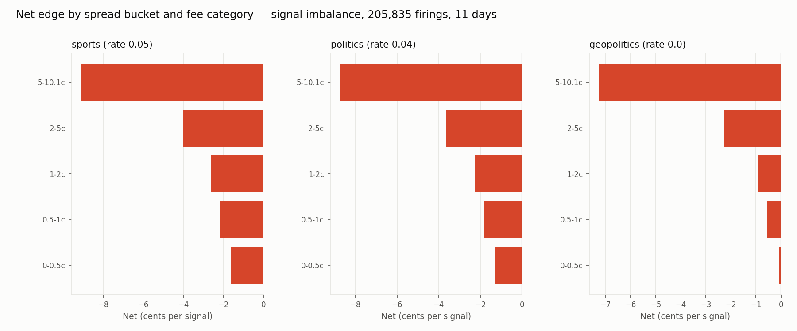
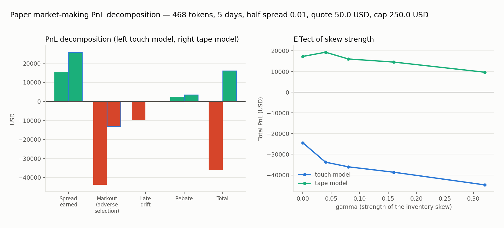

# Prediction Market Terminal

[](https://github.com/Pablozh123/prediction-market-terminal/actions/workflows/ci.yml)

**Live: [marketintel.dev](https://marketintel.dev)** — research pages served statically from Cloudflare Pages, live market data from the API at `api.marketintel.dev` (Railway).

Microstructure research on Polymarket and Kalshi from self-recorded data, and the research terminal it runs on. Read-only throughout: no order path exists in this codebase, and the authenticated Kalshi socket signs `GET` only.

## Research

Four recorders run continuously across both venues — REST pollers on a 120-second grid, event-driven WebSocket recorders writing on every top-of-book change — feeding eight analysis modules. Every finding below has a report and a tested module behind it, and every cost is subtracted separately for spread and fee.

- **Book imbalance predicts direction and is still not tradable as a taker.** At a five-minute horizon with no decision delay: 205,835 firings over 11 days, 55.5% hit rate, Wilson lower bound 55.2%. The study runs four further horizon/delay cells on the same 370,423 snapshots; they are reported separately, never pooled (summed they would read 1,011,556 observations at 55.2%, more observations than snapshots). Mean gross edge +0.09 cents per firing at that cell, +0.03 to +0.13 across the five cells, against a 2.58 cent round trip (0.938 spread, 1.646 fee). 34 cuts knowable before the trade fail to rescue it; the one survivor has a confidence interval containing zero, which is the expected false-positive count at 34 tests.

  
- **Market making loses to staleness, not to spread width — and whether it pays is not identified.** Same code and parameters on five days of seconds-resolution data instead of a 120-second grid, tape fill model throughout: markout per fill falls from 362 to 70 cents while spread earned per fill barely moves, 138 against 148. The decomposition is an identity, not an estimate — spread capture plus markout plus late drift reconstructs terminal mark-to-mid exactly, asserted to nine decimal places in the tests. Five days is also the first sample where the daily block bootstrap runs, and it puts the two fill models on opposite sides of zero with neither interval touching it: touch (-12,121, -2,413) USD per day, tape (+881, +5,889). More data sharpened the ambiguity instead of resolving it; settling the sign needs queue position, not more days.

  
- **Cross-venue gaps are carry, not arbitrage, and they prove it by staying open.** Net of both fee curves, 3 of 5 verified pairs clear: best 3.07 cents, all settling in 2027 or 2028, so 0.5 to 1.8% annualised. Reconstructed over 11.6 hours from both recorders, 3 of the 5 were open at every moment observed.
- **Two venues can price the same event and settle it differently.** Kalshi resolves the 2028 presidential market on who is next inaugurated, Polymarket on who wins the election. A basket over that pair loses both legs instead of hedging — and that pair had passed this project's own title-based mismatch screen as clean.

Discarded along the way, and documented as such: signal-conditioned quoting (better total PnL, unchanged markout per fill — the gain was only from trading less), signed order flow as a signal (51.7% hit rate at the same five-minute, no-delay cell, Wilson lower bound 51.3%, gross edge negative before costs), and two apparent cross-venue edges of 79 and 64 cents that turned out to be mismatched pairs.

**Start here:** [one-page summary](docs/research/ONE_PAGER.md) · [full index of studies](docs/research/README.md)

## Live runs, pilot, field notes

The research above is read-only. Alongside it, a separate codebase — [multi-agent-orchestration-informational-efficiency](https://github.com/Pablozh123/multi-agent-orchestration-informational-efficiency), the bachelor-thesis pipeline — traded small stakes with real money on Polymarket in July and August 2026, and this terminal publishes what came out of that: the runs, the pre-registered pilot, the post-mortems, and the field notes. Nothing in *this* repository places orders; the published files under `public/data/` are the review artifacts of that other system.

- **Mentions bot, live.** Podcast and earnings-call "will X be said" markets: a content-drop prober, GPU transcription in 20-second chunks, speaker attribution, and a decision layer that buys YES only after the live count has already crossed the threshold and NO only after the full transcript at a stricter cap. Executed as fill-and-kill clips with a side-dependent price cap. 21 runs, 27 bets, 25 won. The measured lesson is negative and stated as such: the market reprices a spoken word in 1–4 seconds, the pipeline needs 15–25, so the single-word latency race is structurally lost — the edge that remained lives in doubt windows and count brackets, and the bot was still first taker on the traded side in 11 of 15 reconciled bets.
- **Wallet-verified, not log-verified.** The runs page shows two PnL figures side by side because they differ: the log-reconstructed +$288.67 and the wallet-reconciled +$175.09 as of 2026-07-18 (root cause: the order response's `price` field is the cap, not the fill — post-mortem 2026-07-18). The trading wallet is public, `0x29afe1bf37700768a640a08f1b35dad5f202f88d`; anyone can rerun the check. Against the public Data API on 2026-08-16: deposits $339.83 (wallet reconciliation), 83 trades and 42 redeems between 2026-07-03 and 2026-08-11 across 29 events, $1,474.53 bought, $1,943.77 returned through sells and redemptions, net **+$469.25** — 36 winning positions, 17 losing (10 of them expired worthless), one flat; the largest single loss $22 on an All-In "Tension" NO. Small stakes, one wallet, six weeks: a record of process, not a return claim.
- **Pre-registered pilot.** Rules frozen 2026-07-18 before the first trade, budget 100 USDC, two arms, exit only at resolution; the watcher scanned 1,992 markets, 20 trades were placed in one batch, and the page grades rule adherence trade by trade — including the deviations.
- **Post-mortems.** Nine incidents that cost money or data, each with impact and verified fix: false trigger on a special episode, market makers pulling every quote at the drop, silent bot deaths on session teardown, a log that disagreed with the wallet.
- **Field notes.** Five things the tape taught that no study captures cleanly: a near-certain YES that repriced ten-fold on a UMA dispute without any news; resting orders pennied within seconds by automated laddering; thin markets where the first resolution proposer defines the outcome; a Ukraine map market that traded nothing for eighteen minutes and then swept the ladder in one block; and why the latency race was abandoned. Each note carries observation, mechanism, consequence, and what evidence backs it.

All of this is in the control-room frontend under **Research** (see below) and in [`public/data/`](public/data/).

## The terminal

Streamlit research terminal: market discovery, trader/wallet research, live public flow, whale/insider risk screening, backtesting, alerts, tracking, portfolio research, and paper-only copy-trading. It is the platform the research above runs on, and the place where wallet-level findings are checked against out-of-sample outcomes.

All market data comes from the public Polymarket (Gamma/Data/CLOB) and Kalshi APIs. Live trading is disabled — the copy-trading module is paper-only. The app is a research tool, not investment advice.

> **Continuing the project / picking up on another machine?** Start with [docs/HANDOFF.md](docs/HANDOFF.md) — current state, roadmap, conventions, and the next concrete step.

## Run locally

Python 3.12 or newer. CI runs the suite on 3.12 and 3.13; the container image
ships 3.13.

```powershell
python -m streamlit run prediction_terminal.py --server.address=127.0.0.1 --server.port=8503
```

Open `http://127.0.0.1:8503/`.

### Control-room frontend (new)

A standalone dark-terminal frontend lives under `web/`, served together with a
read-only JSON API by `api/server.py`:

```powershell
python api/server.py
```

Open `http://127.0.0.1:8787/`. There is no demo dataset: a panel either shows
measured data or states which endpoint or published file it is waiting for, and
whether that source answered with nothing or not at all. Nothing is drawn from
a generator — the charting code cannot produce a curve without a real series
behind it. The trading workspaces (markets, live tape, cross-venue, resolved,
leaderboard, whale flow, risk screen, tracked, paper copy-trading, backtester,
portfolio, alerts, settings) reuse the exact same logic modules in `app/` and
`src/` as the Streamlit app — the API only orchestrates and maps to JSON
(`app/api_views.py`). Sample sizes, confidence intervals,
`capped`/`window_truncated` flags and snapshot timestamps are part of every
score-bearing response. The Streamlit app is unchanged and keeps working as
before.

The **Research** group of the sidebar holds ten pages that render from the
published files in `public/data/` and need no API at all — they work as a
static site: Review queue, Category efficiency, Mentions latency, Live runs,
Microstructure, Pilot, Pipeline forward, Methodology, Postmortems, Field notes.
`microstructure.json` is generated here (`scripts/publish_microstructure.py`);
the other files are written by the sister repository's daily review run.

Optional background runners:

```powershell
python scripts/run_copy_trader.py --interval 1 --api-interval 30 --settlement-interval 180   # paper copy daemon
python scripts/run_alert_scanner.py                                                          # Telegram alert scanner
```

## Deploy publicly

The repo ships production artifacts — see [docs/PRODUCTION_READINESS.md](docs/PRODUCTION_READINESS.md) for the full guide (hosting, security, Swiss legal checklist, API terms, costs).

```bash
cp .env.example .env       # set DOMAIN=, optionally Telegram secrets (env overrides the settings file)
docker compose up -d --build
```

This starts the control room (`https://$DOMAIN`, FastAPI + `web/` + `public/data/`), the Streamlit terminal (`https://app.$DOMAIN`), the alert scanner, and Caddy (automatic TLS + security headers) as the only public entry point. The two expensive API routes (`/api/backtest`, `/api/risk`) are rate-limited per IP; the limits are env-tunable (see `.env.example`).

**Static research site (no server needed).** The ten Research pages need no API:

```bash
python scripts/build_static_site.py     # writes dist/ = web/ + public/data/
```

Upload `dist/` to any static host (Cloudflare Pages, GitHub Pages, Netlify). Trading pages then show their honest "API did not answer" state instead of numbers.

**Split hosting (static site + PaaS API).** The static site can point at an API on another host: `python scripts/build_static_site.py --api-base https://api.example.org` (or env `API_BASE_URL`) fills `<meta name="api-base">` in `dist/index.html`. The repo ships a `railway.json` — connect the repo on Railway, it builds the Dockerfile and starts `python api/server.py`, which binds `0.0.0.0:$PORT` when `PORT` is set. Set `CORS_ORIGINS=https://example.org` on the API host so the static origin may call it. Preview deployments get their own subdomain per branch (Cloudflare Pages does), so a fixed list cannot cover them — set `CORS_ORIGIN_REGEX='https://.*\.example\.pages\.dev'` as well and the previews see live data too.

The wallet ledger refreshes itself: `.github/workflows/refresh-wallet-ledger.yml` rebuilds `public/data/wallet_ledger.json` from the public Data API every six hours and commits only real changes, so both hosts redeploy with fresh wallet figures on their own.

### Optional: Google sign-in for the Settings page

Without auth secrets the app runs in open local-research mode — no sign-in surface, Settings unrestricted. To restrict Settings on a public deployment, copy [.streamlit/secrets.toml.example](.streamlit/secrets.toml.example) to `.streamlit/secrets.toml` (gitignored), fill in the Google OIDC credentials, and set the admin allowlist (`[admin] emails` in secrets, or the `ADMIN_EMAILS` env var which takes precedence). With auth configured, Settings fail closed: only signed-in, allowlisted accounts can change configuration, while all research workspaces stay public. For Docker, uncomment the secrets volume in `docker-compose.yml`.

## Workspaces

Overview, Search, Markets, Traders, Track, Live Trades, Wallets, Backtester, Copy Trade, Whale Flow, Suspicious, Cross-Venue, Monitor, Resolved, Portfolio, Settings.

Highlights:

- **Backtester** — replay any wallet's trades over 7/30/90 days with Copy or Fade strategy, four sizing modes, exposure cap, mid-window resolution recycling, and a best-sizing simulation drawn into the equity chart.
- **Suspicious** — event/wallet insider-risk scores from public whale flow with category context (sports odds, weather and crypto/market prices are excluded — nothing to know early there, and the 15-minute crypto markets would only add noise), fresh-wallet clusters, coordinated-timing clusters, and a Louvain co-trading network with click-to-isolate cluster stories.
- **Traders** — Polymarket leaderboard with podium, smart-score ranking, speed traders, insider-picks feed, and on-demand enrichment (open positions, win rates, balances) from public wallet data.
- **Monitor** — signal scanner (fast movers, volume anomaly, whale prints, tight spreads, holder concentration, endings) with saved alert rules and Telegram delivery.
- **Kalshi integration** — markets, trades (with real market titles), cross-venue gaps, and event-level whale/insider signals; Kalshi publishes no wallet identities, so wallet-level scoring skips those rows and the UI says so.

Most pages accept URL query filters, e.g. `/markets?q=bitcoin&platform=polymarket&probMin=0.05`, `/live-trades?side=buy&minNotional=2500&whale=true`, `/traders?bot=true&apMin=101`.

## Data boundaries

- Polymarket exposes public proxy-wallet, position, activity, trade, holder, and leaderboard data.
- Kalshi public feeds expose market and trade data, but no trader identities.
- Wallet labels, bot-like labels, whale labels, and flow traits are heuristics from public data.
- The app does not place real orders on any venue.

## Paper copy-trading

The copy desk follows **several Polymarket wallets at once**, one paper sub-account each (same start cash, same sizing settings — the sub-accounts are the comparison), with local SQLite persistence (`data/copy_trading.sqlite`), paper-only accounting, per-wallet baseline seeding, settlement recycling, per-trader equity curves, CSV exports (Streamlit), and URL filters such as `/copy-trade?status=copied,baseline`.

Two front ends drive the same books: the Streamlit Copy Trade page, and the **Copy trade page of the control room** (`api/server.py` → `#copy`), which on this machine is a small admin desk: paste a wallet (address, profile URL or leaderboard handle), give it a label, start cash and a note, follow it — the wallet's open positions are mirrored and its recent trades recorded as observed, so only what it does from then on is copied. Traders can be paused (books kept) and resumed (baseline re-seeded), topped up, relabelled; the sizing settings are edited in place; one sync pass can be run from the page. Writes are accepted from loopback only, or with `COPY_ADMIN_TOKEN` (`X-Admin-Token`); everyone else sees the books read-only. Locally, `scripts\start_paper_desk.ps1` starts API and daemon together and opens the desk; the daemon alone is `scripts/run_copy_trader.py`. On the live host the same loop runs inside the API process (`COPY_DAEMON=1`, `app/copy_daemon.py`) with the books on the mounted volume (`COPY_DATA_DIR`), so the desk at marketintel.dev/#copy is operated from any browser holding the token.

Accounting is contribution-aware: every cash injection (start cash, manual or auto top-up) is tracked separately from trading PnL, the equity chart draws equity against the contributions step line, and auto top-up is **off by default** — when a sub-account runs out of cash, buys skip visibly until settlements recycle funds.

Sizing aims for a faithful scaled mirror of the source wallet: the default scale is the uncapped neutral portfolio ratio (your sub-account equity / source equity), a cash throttle shrinks all orders uniformly during cash droughts instead of skipping later trades, and the Copy fidelity tab quantifies every deviation — config fidelity (settings vs neutral), execution fidelity (filled vs desired, with loss breakdown), and a %-PnL overlay of the paper curve against the source wallet's official PnL curve.

## Main files

Every piece of logic lives in a Streamlit-free module under `app/` or `src/`
with its own test file; `prediction_terminal.py` holds only `render_*` and
`page_*` functions and is large because it is the whole UI in one file rather
than because the logic sits there. Three consumers import those same modules —
the Streamlit app, the JSON bridge in `api/server.py` behind the `web/`
frontend, and the background runners in `scripts/` — so a change to the fee
model or a score reaches all of them at once, and its tests cover all of them
at once.

| File | Purpose |
|---|---|
| `prediction_terminal.py` | Streamlit app (all workspaces + UI) |
| `src/prediction_markets.py` | Public API clients and analytics helpers |
| `src/copy_trading.py` | SQLite-backed paper copy-trading engine (one sub-account per followed wallet) |
| `app/copy_admin.py` | The copy desk behind the web page: write gate, follow/pause with baseline seeding, settings, one-shot sync, daemon status |
| `web/js/pages/copy_page.js` | Copy trade page of the control room (traders, follow form, settings, sync) |
| `app/backtester.py` | Streamlit-free backtest engine |
| `app/suspicion.py` | Insider-risk scoring, clusters, co-trading network |
| `app/signals.py` | Monitor signal/rule logic (shared with the scanner) |
| `app/app_settings.py` | Persisted settings with env-var secret overrides |
| `app/authz.py` | Admin-gate logic for the Settings page (`st.login()` + allowlist, fail closed) |
| `scripts/run_alert_scanner.py` | Background alert scanner with Telegram delivery |
| `scripts/run_copy_trader.py` | Background paper-copy sync runner |
| `Dockerfile` / `docker-compose.yml` / `deploy/Caddyfile` | Production deployment |
| `docs/PRODUCTION_READINESS.md` | Public-launch guide (hosting, security, legal, costs) |

## Verification

```powershell
python -m py_compile prediction_terminal.py src\prediction_markets.py src\copy_trading.py
python -m unittest discover -s tests -p test_*.py
python scripts/smoke_routes.py
python -m scripts.visual_smoke --base-url http://127.0.0.1:8503 --output-dir artifacts\visual_smoke --timeout-ms 45000
```

The full Streamlit page smoke (network-dependent) runs with `RUN_APP_SMOKE=1 python -m unittest tests.test_app_smoke -v`.

Terminal UX smoke (Playwright, headless Chromium, not in CI): `python scripts/ux_smoke.py --base-url http://127.0.0.1:8790` against a running `api/server.py`, or `--static` against `python -m http.server -d dist 8791` after `scripts/build_static_site.py` — clicks every page, study, sub-tab, the palette, the drawer and the deep links; exits non-zero on console errors, failed requests, an address out of step with the page, lost `<details>` state or an anchor that did not scroll (`pip install playwright && playwright install chromium` once).
